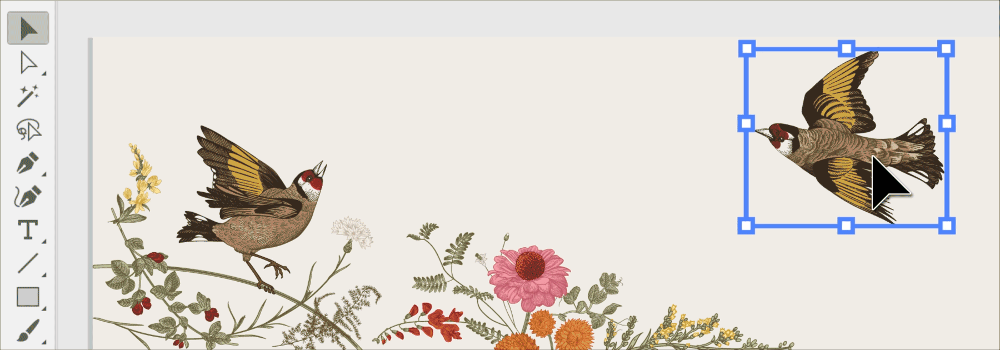
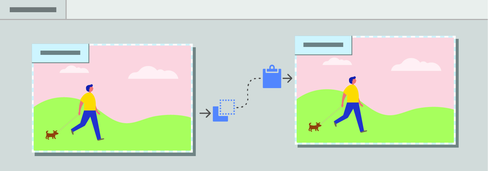
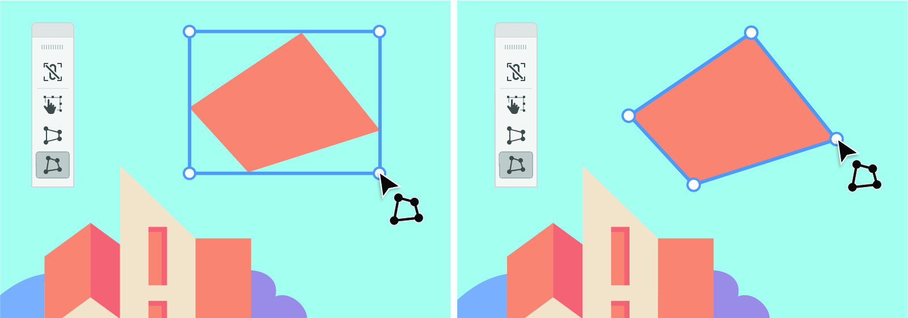

学习关于2020年3月份更新的功能和增强的功能，(mac os 版本 24.1) 以及 （windows 24.1.1）版本

### 1. 实时绘制和编辑
   
   这个功能可以在对对象缩放和各种效果的时候，兑现不再只显示一个外框的效果，而是由完整的平滑动画渲染。
   
 设置一下的选项来启用此功能：
   1. [Windows] 选择 编辑>设置>实时绘制和编辑
   2. [macOS] 选择 Illstrutor > 设置 > 性能 > 实时绘制和编辑
   
 请注意：如果Illustrator在实时渲染对象的时候侦查到到任何配置问题，它就会自动的改变成非实时状态。

 #### 支持工具
 以下工具支持实时绘图和编辑
 1. 圆弧工具 Arc Tool
 2. 圆角平滑工具 Corner Smoothening Tool
 3. 曲率工具 Curvature Tool
 4. 曲率控件 Curvature Widgets
 5. 直接选择工具 Direct Select Tool
 6. 圆形工具 Ellipse Tool
 7. 渐变工具 Gradient Tool
 8. 直线工具 Line Tool
 9. 实时圆角空间 Live Corner Widgets
 10. 实时形状工具 Live Shpae Tool
 11. 极地网格工具 Polar Grid Tool
 12. 多边形工具 Polygon Tool
 13. 矩形工具 Rectangle Tool
 14. 矩形网格工具 Rectangle Grid Tool
 15. 映射工具 Reflect Tool
 16. 旋转工具 Rotate Tool
 17. 圆角矩形工具 Rounded Rectangle Tool
 18. 缩放工具 Scale Tool
 19. 选择工具和边界相关的工具信息 Selection Tool & Bounding Box related Transformation
 20. 剪切工具 Shear Tool
 21. 螺旋工具 Spiral Tool
 22. 星星工具 Star Tool
   
 其他备注：实时体验工具不支持自提，横向字体，以及宽度工具

### 2. 剪切、拷贝、粘贴画板到不同的文档中:
 
   你可以拷贝以及粘贴整个画板到不同的开放文档中。选择下列选项：
   1. 拖动和放下画板在两个文档之间
   2. 使用剪切、复制和粘贴选项在编辑菜单中
   3. 使用键盘快捷键

### 3. 增强的自由扭曲 (Enhanced Free Distort)
   
   
   自由的扭曲可以让你自由的修改整个盒子。现在，盒子就更容易的工作了，并且能够让你无缝编辑对象，且不需要重置。

### 4. 内置App问题排查支持
   这个版本会提供更好地问题排查(troubleshooting)支持，主要是关于文件损坏和配置相关的详细内容：
   1. Illstrator 配置问题排除
   2. 识别并排除有问题的文件

### 5. 优化工具栏
   在你使用拖拽工具的时候在工具栏和绘画栏中会有更直观的体验。

### 6. 稳定性和性能
   我们对每一个版本都提供了更好地稳定性
   
   这个版本我们也有更好的应用性能，更稳定、更平滑的工作流。
   
   关于详细内容，请访问Fixed issues

